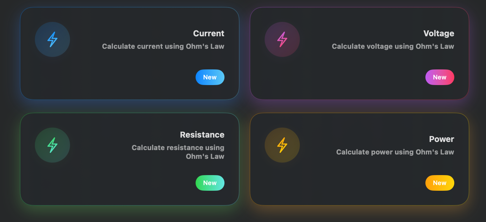

# ProfessionalCard


**ProfessionalCard** is a SwiftUI component that displays a clean and elegant personal card. Easily customizable and perfect for apps that want to present contact or professional information in a stylish way.

## ✨ Features

- Modern card design
- SwiftUI-native
- Fully customizable: name, title, contact info, colors
- Works on both iOS and macOS
- Lightweight and dependency-free

## 🛠 Installation

### 📦 Swift Package Manager (SPM)

You can add this package directly through **Xcode**:

1. Open your project in Xcode.
2. Go to **File > Add Packages...**
3. Enter the URL of the repository: https://github.com/Ivan-Bondaruk/ProfessionalCard
4. Select version `1.0.1` or **Up to Next Major**.
5. Click **Add Package**.

That's it! The package is now ready to use in your SwiftUI project.

## 💻 Requirements

- iOS 13.0+ / macOS 13.0+
- Xcode 16
- Swift 6.1
- SwiftUI framework

## Screenshots


## 🧩 Usage

```swift
import ProfessionalCard

ProfessionalCardView(title: "Analytics",
  subTitle: "View detailed perfomance metrics and insights",
  iconName: "chart.line.uptrend.xyaxis",
  gradientColors: [.blue, .cyan  ], badgeText: "New") {
  // Action Here
}
